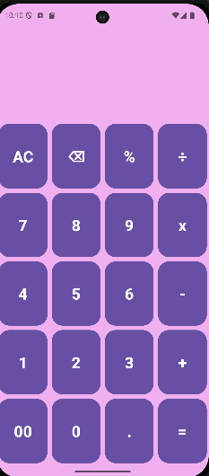
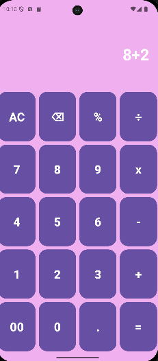
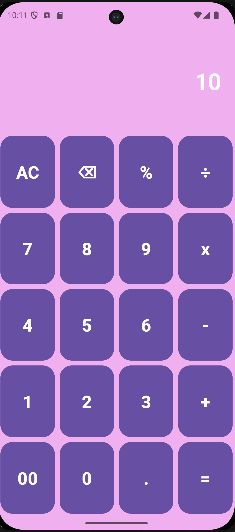

# 🧮 Simple Calculator Android App

## 📌 Project Overview

Simple Calculator is an Android application developed using **Java** and **XML** in **Android Studio**. The application performs basic arithmetic operations through a clean and user-friendly interface.

This project was created to strengthen Android development fundamentals, including layouts, event handling, and user interaction.

---

## 🎯 Features

- Addition
- Subtraction
- Multiplication
- Division
- Simple and clean UI
- Instant calculation results
- Input validation

---

## 🛠 Technologies Used

- Java
- XML
- Android Studio
- Android SDK

---

## 📷 Application Screenshots

The following screenshots demonstrate the application's user interface and calculation workflow.

### Splash Screen


---

### Home Screen



---

### Addition Example

**Expression:** 8 + 2



---

### Result

**Output:** 10



This example demonstrates the calculator successfully performing an addition operation.

---

## 📂 Project Structure

```
Simple-Calculator/
│
├── app/
├── gradle/
├── screenshots/
├── README.md
├── LICENSE
└── .gitignore
```

---

## 🚀 How to Run

1. Clone the repository

```bash
git clone https://github.com/ankitrwt-ds/simple_calculator.git
```

2. Open Android Studio.

3. Select **Open Project**.

4. Sync Gradle.

5. Run the application on an emulator or Android device.

---

## ✨ Skills Demonstrated

- Android UI Design
- XML Layout Design
- Java Programming
- Event Handling
- Android Activity Lifecycle
- Input Validation
- Git & GitHub

---

## 🔮 Future Improvements

- Scientific Calculator
- Calculation History
- Dark Mode
- Unit Converter
- Currency Converter
- Improved Material Design UI
- Enhanced Error Handling
---

## 👨‍💻 Author

**Ankit Rawat**

Built as part of my Android Development learning journey.
